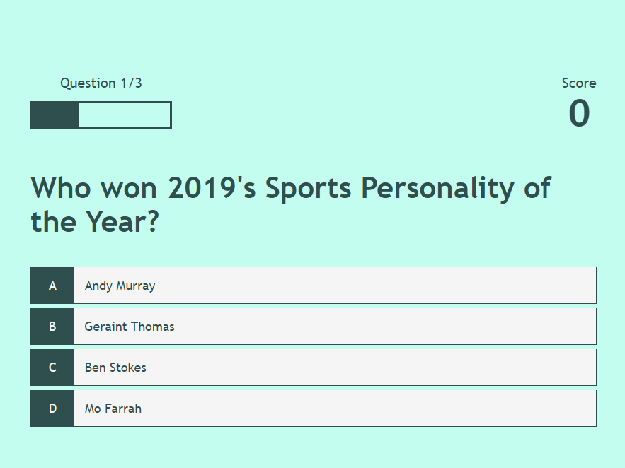
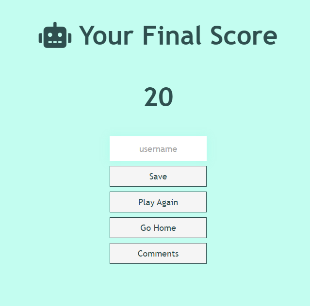
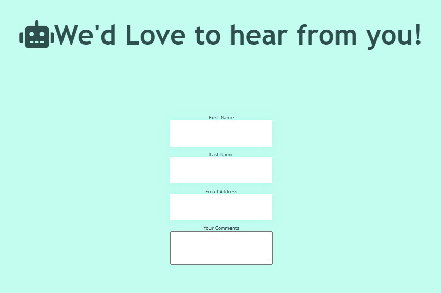

<h1>Kirstys Kwiz!</i></h1>
 

<h2><b>Project 2 -</b> <i>Build an online Quiz</i></h2>
 

<h3><b>About</b></h3>

A general knowledge quiz where users can pit their wits against the questions asked by the computer. Scores are recorded so progress can be monitored.

 
Questions taken from <a href="https://www.radiotimes.com/quizzes/pub-quiz-general-knowledge/" target="_blank">Radio Times</a>
 
 
<h3><b>Homepage</b></h3>

 

<h3><b>Questions Page</b></h3>

 

<h3><b>Final Score Page</b></h3>

 

<h3><b>Feedback Page</b></h3>

 

<h4><b>Tech Required</b></h4>
<ul>
    <li>HTML</li>
    <li>CSS</li>
    <li>JavaScript</li>
</ul>
 
<h4><b>Constants</b></h4>

Rem is used to define sizes of selected objects relevant to root font-size. Used <b>rem</b> calculated to 62.5% for font-size, based on most browsers having font-size as 16px. Styling is consistent throughout.

 
<h4><b>Errors & Validation</b></h4>

Issue with styling of feedback page navigation buttons needs to be resolved. Submit and reset buttons not included as part of the feedback form due to lack of understanding of JavaScript.
 
Site not completed – I was confused by the structure of the syllabus. When I completed the comparative language section it went onto the P2 requirements. I automatically assumed I was required to build the project based on the principles of self-learning by searching online, comparing JavaScript to the languages I have learned so far. I was able to get much of it however I struggled when it came to inserting images and building forms.
 
As I have not met the requirements for this project, it will fail. When I come to re-submit, I will have learned JavaScript, enabling me to include the required elements.
 
When trying to access console when inspecting on browser received a message stating that it failed to load resource with an error of 404. Searched internet, found resoultion on  <a href="https://stackoverflow.com/questions/22317206/failed-to-load-resource-the-server-responded-with-a-status-of-404-not-found target="_blank">Stack Overflow</a>
 
No validation has taken place due to the project not being completed.

 
<h4><b>References</b></h4>

JavaScript research was taken from <a href="https://www.sitepoint.com/simple-javascript-quiz/" target="_blank">Site Point,</a> <a href="https://www.geeksforgeeks.org/how-to-create-a-simple-javascript-quiz/" target="_blank">Geeks for Geeks</a>, and <a href="https://www.w3schools.com/js/js_quiz.asp" target="_blank">W3 Schools.</a> 
 
Used Emmet docs for reference, found it quicker to write code.
 
Communicated on <a href="https://app.slack.com/client/T0L30B202/C027C3PLS1W/thread/C027C3PLS1W-1631127857.084600" target="_blank">Slack</a>, particulary when it came to looking into adding images.
 
Icons taken from <a href="https://kit.fontawesome.com" target="_blank">Font Awesome</a>. 

