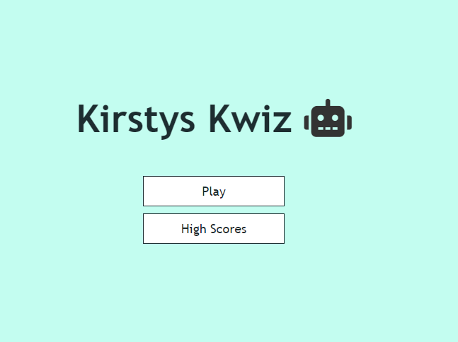

<h1>Kirstys Kwiz!</i></h1>
 

<h2><b>Project 2 -</b> <i>Build an online Quiz</i></h2>
 

<h3><b>About</b></h3>

A general knowledge quiz where users can pit their wits against the questions asked by the computer. Scores are recorded so progress can be monitored.

 

<h3><b>Homepage</b></h3>

 

<h4><b>Tech Required</b></h4>
<ul>
    <li>HTML</li>
    <li>CSS</li>
    <li>JavaScript</li>
</ul>

Used Emmet docs for refernce, found it quicker to write code.

Rem is used to define sizes of selected objects relevant to root font-size. Used <b>rem</b> calculated to 62.5% for font-size, based on most browsers having font-size as 16px. 

When trying to access console when inspecting on browser received a message stating that it failed to load resource with an error of 404. Searched internet, found resoultion on  <a href="https://stackoverflow.com/questions/22317206/failed-to-load-resource-the-server-responded-with-a-status-of-404-not-found target="_blank">Stack Overflow</a>

Questions taken from <a href="https://www.radiotimes.com/quizzes/pub-quiz-general-knowledge/" target="_blank">Radio Times</a>

Used flex-box throughout - I found this easier to center my elements.

